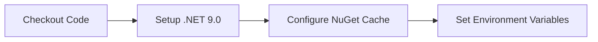
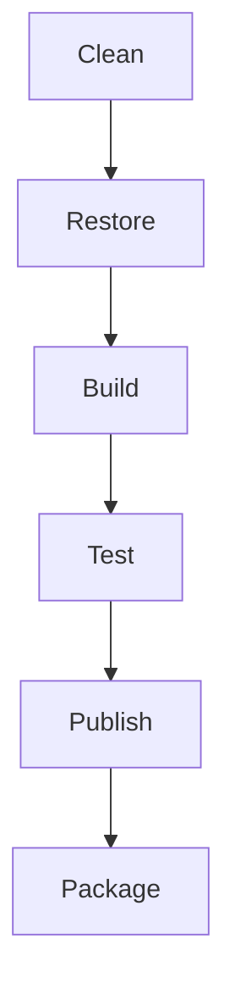

# Build System

## Overview

AGI.Kapster uses a modern **NUKE Build System** integrated with **GitHub Actions** for automated CI/CD workflows, providing cross-platform build automation with PowerShell integration.

## Architecture

### Local Build Commands
```powershell
# Windows (PowerShell)
.\build.ps1 [Target] [Parameters]

# Cross-platform using .NET
dotnet run --project build -- [Target] [Parameters]
```

### Available Build Targets
- `Clean` - Clean build output directories
- `Restore` - Restore NuGet packages with caching
- `Build` - Compile all projects for current platform
- `Test` - Run unit tests with coverage collection
- `Publish` - Create runtime-specific self-contained builds
- `Package` - Generate platform-specific installers
- `UpgradeVersion` - Generate and lock new time-based version
- `Info` - Display build information and version details

### GitHub Actions Integration
The build system integrates with GitHub Actions through:
- **Composite Actions**: Reusable workflow components for .NET setup
- **Parameter Arrays**: PowerShell parameter passing to NUKE targets
- **Artifact Management**: Structured output organization and caching
- **Multi-Platform Support**: Windows, macOS, and Linux builds

## CI/CD Workflow Architecture

| Workflow | Purpose | Trigger | Key Features |
| -------- | ------- | ------- | ------------ |
| `ci.yml` | Main CI pipeline | Push/PR | Build validation, test execution |
| `quality.yml` | Quality gates | Scheduled | Coverage reporting, dependency audit |
| `release.yml` | Release automation | Tag push | Multi-platform packages, GitHub releases |
| `verify-version.yml` | Version validation | PR | Ensure version.json consistency |
| `create-release.yml` | Manual release | Workflow dispatch | Controlled release creation |

### Composite Actions
- **setup-environment**: Complete environment setup with checkout and .NET 9.0
- **setup-dotnet-only**: Lightweight .NET setup without checkout
- **setup-dotnet-env**: Legacy .NET setup (kept for historical compatibility)
- **build-and-test**: Standardized build and test execution
- **publish-package**: Multi-platform publishing and packaging

## Build Process Flow

### 1. Environment Setup


### 2. Build Pipeline


### 3. Multi-Platform Matrix
```yaml
strategy:
  matrix:
    os: [ubuntu-latest, windows-latest, macos-latest]
    runtime: [linux-x64, win-x64, osx-x64]
```

## Platform-Specific Features

### Windows
- **MSI Packaging**: WiX Toolset integration
- **Code Signing**: Authenticode support (when configured)
- **PowerShell Scripts**: Native PowerShell build automation

### macOS
- **PKG Creation**: macOS installer packages
- **App Notarization**: Apple Developer integration (when configured)
- **Universal Binaries**: x64 and ARM64 support

### Linux
- **DEB Packages**: Debian/Ubuntu package creation
- **RPM Packages**: Red Hat/CentOS package creation
- **AppImage**: Portable application format

## Performance Optimizations

### Caching Strategy
- **NuGet Packages**: Cached by lock file hash
- **Build Artifacts**: Cached by source hash
- **Docker Layers**: Optimized layer caching

### Parallel Execution
- **Multi-Target Builds**: Parallel compilation
- **Test Execution**: Parallel test runners
- **Package Creation**: Concurrent packaging

### Resource Management
- **Memory Limits**: Configured for GitHub Actions runners
- **Disk Space**: Automatic cleanup of temporary files
- **Network**: Optimized package restore

## Configuration

### Version Management
```json
{
  "version": "2024.9.23.1547",
  "assemblyVersion": "2024.9.23.1547",
  "fileVersion": "2024.9.23.1547",
  "informationalVersion": "2024.9.23.1547"
}
```

### Build Configuration
```xml
<PropertyGroup>
  <TargetFramework>net9.0</TargetFramework>
  <UseAppHost>true</UseAppHost>
  <PublishSingleFile>true</PublishSingleFile>
  <PublishTrimmed>false</PublishTrimmed>
</PropertyGroup>
```

### Environment Variables
```bash
DOTNET_NOLOGO=true
DOTNET_CLI_TELEMETRY_OPTOUT=true
NUGET_PACKAGES=/github/workspace/.nuget/packages
```

## Development Workflow

### Local Development
```bash
# Full build and test
./build.ps1

# Specific target
./build.ps1 Test

# With parameters
./build.ps1 Publish --runtime win-x64
```

### CI Integration
```yaml
- name: Build and Test
  uses: ./.github/actions/build-and-test
  with:
    target: 'Test'
    verbosity: 'minimal'
```

### Release Process
```bash
# Version upgrade
./build.ps1 UpgradeVersion

# Create release tag
git tag v2024.9.23.1547
git push origin v2024.9.23.1547
```

## Troubleshooting

### Common Issues

#### Build Failures
```bash
# Clear all caches
./build.ps1 Clean

# Restore with verbose logging
./build.ps1 Restore --verbosity detailed
```

#### Version Conflicts
```bash
# Check current version
./build.ps1 Info

# Verify version consistency
./build.ps1 CheckVersionLocked
```

#### Package Issues
```bash
# Rebuild packages
./build.ps1 Clean Package

# Verify package contents
./build.ps1 Package --verbosity diagnostic
```

### Debug Mode
```bash
# Enable debug output
./build.ps1 [Target] --verbosity diagnostic

# Skip version checks
./build.ps1 [Target] --skip-version-check
```

## Best Practices

### Local Development
- Run `./build.ps1 Test` before committing
- Use `./build.ps1 Info` to verify version state
- Keep build output clean with regular `Clean` targets

### CI/CD Pipeline
- Use composite actions for consistency
- Cache aggressively but invalidate appropriately
- Monitor build performance and optimize bottlenecks

### Version Management
- Always lock versions before creating tags
- Use time-based versioning for predictability
- Validate version consistency in PRs

## Integration Examples

### Custom Build Scripts
```powershell
# Custom PowerShell wrapper
param(
    [string]$Target = "Build",
    [string]$Configuration = "Release"
)

./build.ps1 $Target --configuration $Configuration --verbosity minimal
```

### GitHub Actions Usage
```yaml
- name: Full Build Pipeline
  uses: ./.github/actions/build-and-test
  with:
    target: 'Test'
    configuration: 'Release'
    collect-coverage: 'true'
```

### Docker Integration
```dockerfile
FROM mcr.microsoft.com/dotnet/sdk:9.0 AS build
COPY . /src
WORKDIR /src
RUN ./build.ps1 Publish --runtime linux-x64
```