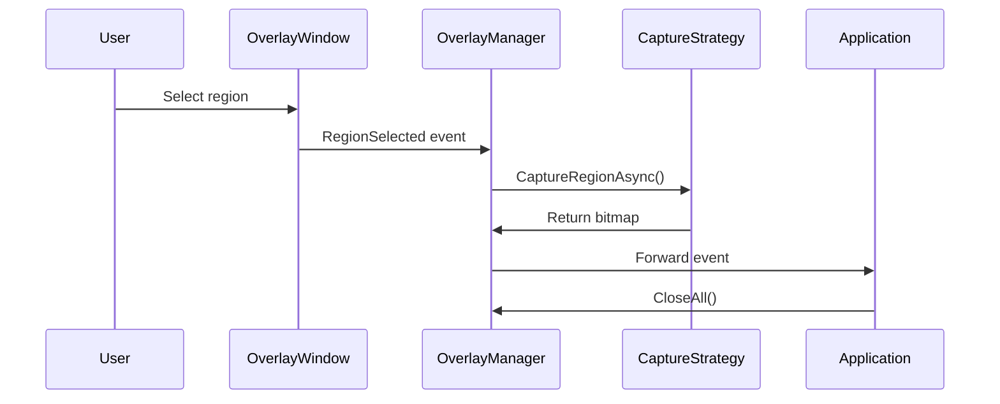
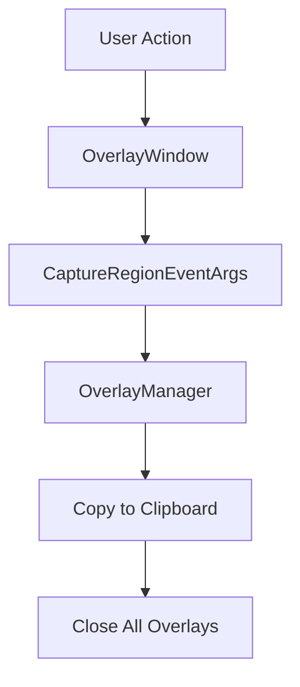

# Overlay System Architecture

## Overview

The overlay system in AGI.Kapster provides transparent overlay windows for screen capture and annotation across multiple platforms. The architecture uses dependency injection without factory patterns, running purely in background mode with system tray integration.

## Core Components

### 1. Service Interfaces

#### IOverlayController
Primary interface for overlay lifecycle management:

```csharp
public interface IOverlayController
{
    void ShowAll();
    void CloseAll();
    bool IsActive { get; }
}
```

**Implementation**: `SimplifiedOverlayManager`
- Manages overlay windows across all screens
- Coordinates multi-screen operations
- Handles event aggregation and forwarding

#### IOverlayWindow
Platform-specific overlay window interface:

```csharp
public interface IOverlayWindow : IDisposable
{
    void Show();
    void Close();
    void SetFullScreen(Screen screen);
    void SetRegion(PixelRect region);
    bool IsVisible { get; }
    bool ElementDetectionEnabled { get; set; }
    Screen? Screen { get; }
    event EventHandler<CaptureRegionEventArgs>? RegionSelected;
    event EventHandler? Cancelled;
    event EventHandler? Closed;
}
```

**Implementations**:
- `WindowsOverlayWindow` - Windows platform implementation
- `MacOverlayWindow` - macOS platform implementation

#### IScreenCaptureStrategy
Platform-specific screen capture implementation:

```csharp
public interface IScreenCaptureStrategy
{
    Task<SKBitmap?> CaptureFullScreenAsync(Screen screen);
    Task<SKBitmap?> CaptureWindowAsync(nint windowHandle);
    Task<SKBitmap?> CaptureRegionAsync(PixelRect region);
    Task<SKBitmap?> CaptureWindowRegionAsync(Rect windowRect, Visual window);
    Task<SKBitmap?> CaptureElementAsync(IElementInfo element);
    bool SupportsWindowCapture { get; }
    bool SupportsElementCapture { get; }
    bool IsHardwareAccelerated { get; }
}
```

**Implementations**:
- `WindowsScreenCaptureStrategy` - Uses Win32 BitBlt API
- `MacScreenCaptureStrategy` - Uses screencapture command

## Architecture Flow

### 1. Initialization


### 2. Capture Workflow


### 3. Event Propagation


## Platform Implementations

### Windows Implementation

#### WindowsOverlayWindow
```csharp
public class WindowsOverlayWindow : IOverlayWindow
{
    public void Show() { /* ... */ }
    public void Close() { /* ... */ }
    public void SetFullScreen(Screen screen) { /* ... */ }
    public void SetRegion(PixelRect region) { /* ... */ }
    public event EventHandler<CaptureRegionEventArgs>? RegionSelected;
}
```

#### WindowsScreenCaptureStrategy
```csharp
public class WindowsScreenCaptureStrategy : IScreenCaptureStrategy
{
    public Task<SKBitmap?> CaptureRegionAsync(PixelRect region) { /* ... */ }
}
```

### macOS Implementation

#### MacOverlayWindow
```csharp
public class MacOverlayWindow : IOverlayWindow
{
    public void Show() { /* ... */ }
}
```

#### MacScreenCaptureStrategy
```csharp
public class MacScreenCaptureStrategy : IScreenCaptureStrategy
{
    public Task<SKBitmap?> CaptureRegionAsync(PixelRect region) { /* ... */ }
}
```

## Service Registration

### Dependency Injection Setup
```csharp
// Program.cs
public static void ConfigureServices(IServiceCollection services)
{
    // Core services
    services.AddSingleton<IOverlayController, SimplifiedOverlayManager>();
    
    // Platform-specific services
    if (RuntimeInformation.IsOSPlatform(OSPlatform.Windows))
    {
        services.AddTransient<IOverlayWindow, WindowsOverlayWindow>();
        services.AddTransient<IScreenCaptureStrategy, WindowsScreenCaptureStrategy>();
        services.AddTransient<IElementDetector, WindowsElementDetector>();
    }
    else if (RuntimeInformation.IsOSPlatform(OSPlatform.OSX))
    {
        services.AddTransient<IOverlayWindow, MacOverlayWindow>();
        services.AddTransient<IScreenCaptureStrategy, MacScreenCaptureStrategy>();
        services.AddTransient<IElementDetector, NullElementDetector>();
    }
    
    // Shared services
    services.AddSingleton<IClipboardStrategy, PlatformClipboardStrategy>();
    services.AddSingleton<ISettingsService, SettingsService>();
}
```

### Factory Pattern Removal

Previous architecture used factory pattern which was removed for simplification:

```csharp
// REMOVED: Unnecessary factory abstraction
public interface IPlatformOverlayFactory
{
    IOverlayWindow CreateOverlayWindow();
    IElementDetector CreateElementDetector();
}

// CURRENT: Direct dependency injection
services.AddTransient<IOverlayWindow, WindowsOverlayWindow>();
services.AddTransient<IElementDetector, WindowsElementDetector>();
```

## Event System

### Event Flow Architecture
```csharp
public class CaptureRegionEventArgs : EventArgs
{
    public PixelRect Region { get; }
    public CaptureMode Mode { get; }
    public object? CaptureTarget { get; }
    public IOverlayWindow? SourceWindow { get; }
}
```

### Event Handling Pattern
```csharp
public class SimplifiedOverlayManager : IOverlayController
{
    private void OnOverlayRegionSelected(object? sender, CaptureRegionEventArgs e)
    {
        // Handle capture pipeline and clipboard copy, then close overlays
        CloseAll();
    }
}
```

## Multi-Screen Support

### Screen Enumeration
```csharp
public void ShowAll()
{
    var screens = GetAvailableScreens();
    foreach (var screen in screens)
    {
        var overlay = _serviceProvider.GetRequiredService<IOverlayWindow>();
        overlay.SetFullScreen(screen);
        overlay.Show();
        overlay.RegionSelected += OnOverlayRegionSelected;
        overlay.Cancelled += OnOverlayCancelled;
        // track overlay instance...
    }
}
```

### Screen Coordinate Handling
```csharp
public PixelRect TranslateToGlobalCoordinates(PixelRect localRect, Screen screen)
{
    return new PixelRect(
        localRect.X + screen.Bounds.X,
        localRect.Y + screen.Bounds.Y,
        localRect.Width,
        localRect.Height
    );
}
```

## Performance Considerations

### Memory Management
- Overlay windows disposed properly on close
- Bitmaps released after use
- Event handlers unsubscribed on cleanup

### Rendering Optimization
- Hardware acceleration enabled where available
- Minimize overlay redraw operations
- Efficient bitmap handling and conversion

### Platform-Specific Optimizations
- **Windows**: DirectX rendering where possible
- **macOS**: Metal rendering integration
- **Cross-platform**: Skia GPU acceleration

## Error Handling

### Platform Capability Detection
```csharp
public bool CanCaptureElements()
{
    return RuntimeInformation.IsOSPlatform(OSPlatform.Windows);
}

public async Task<SKBitmap> CaptureElementAsync(IElementInfo element)
{
    if (!CanCaptureElements())
    {
        throw new PlatformNotSupportedException("Element capture not supported on this platform");
    }
    
    return await _elementDetector.CaptureElementAsync(element);
}
```

### Graceful Degradation
```csharp
public async Task<IEnumerable<IElementInfo>> DetectElementsAsync()
{
    try
    {
        return await _elementDetector.DetectElementsAsync();
    }
    catch (PlatformNotSupportedException)
    {
        // Fall back to manual region selection
        return Enumerable.Empty<IElementInfo>();
    }
}
```

## Testing Strategy

### Interface Mocking
```csharp
[Test]
public void ShowAll_ShouldCreateOverlayForEachScreen()
{
    // Arrange
    var mockOverlay = Substitute.For<IOverlayWindow>();
    var mockServiceProvider = Substitute.For<IServiceProvider>();
    mockServiceProvider.GetRequiredService<IOverlayWindow>().Returns(mockOverlay);
    
    var manager = new SimplifiedOverlayManager(mockServiceProvider);
    
    // Act
    manager.ShowAll();
    
    // Assert
    mockServiceProvider.Received(Screen.AllScreens.Length).GetRequiredService<IOverlayWindow>();
}
```

### Integration Testing
```csharp
[Test]
public async Task EndToEndCaptureWorkflow()
{
    // Arrange
    var services = new ServiceCollection();
    ConfigureTestServices(services);
    var provider = services.BuildServiceProvider();
    
    var overlayManager = provider.GetRequiredService<IOverlayController>();
    
    // Act
    overlayManager.ShowAll();
    
    // Simulate user selection
    var testRegion = new PixelRect(100, 100, 200, 200);
    // Trigger selection event
    
    // Assert
    Assert.That(overlayManager.IsActive, Is.False);
}
```

## Troubleshooting

### Common Issues

#### macOS Black Screen
- **Problem**: Secondary monitors show black overlay
- **Solution**: Proper screen enumeration and window positioning
- **Implementation**: Enhanced screen coverage validation

#### Windows UI Automation Failures
- **Problem**: Element detection fails on some applications
- **Solution**: Fallback to manual region selection
- **Implementation**: Graceful degradation pattern

#### Event Handler Memory Leaks
- **Problem**: Event handlers not unsubscribed
- **Solution**: Proper disposal pattern implementation
- **Implementation**: Using statement and explicit cleanup

### Debugging Tools
```csharp
public class OverlayDebugger
{
    public void LogScreenConfiguration()
    {
        foreach (var screen in Screen.AllScreens)
        {
            Console.WriteLine($"Screen: {screen.DeviceName}, Bounds: {screen.Bounds}, Primary: {screen.Primary}");
        }
    }
    
    public void ValidateEventSubscriptions()
    {
        // Check for memory leaks in event subscriptions
    }
}
```