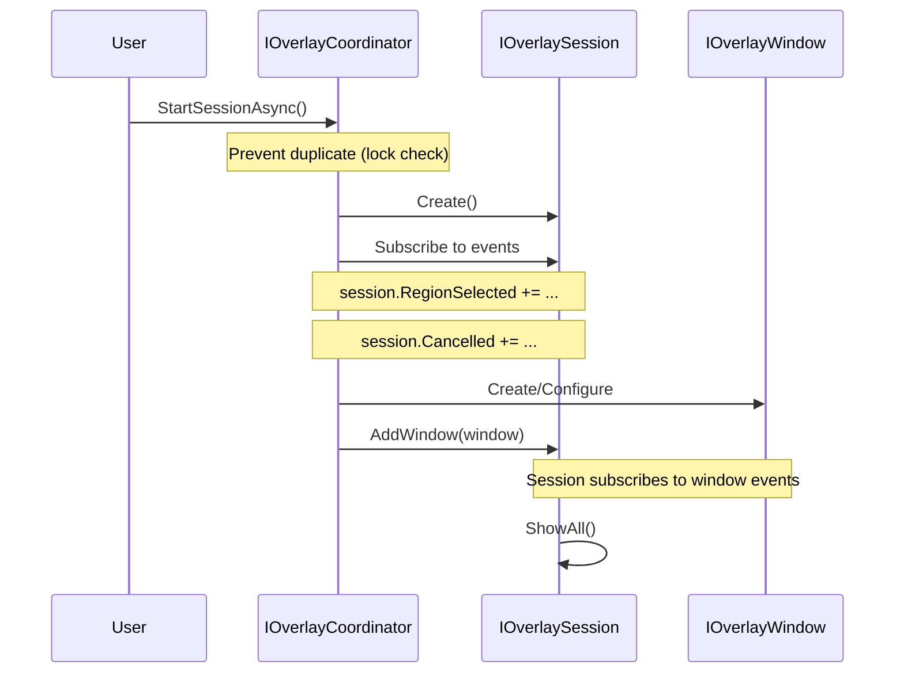
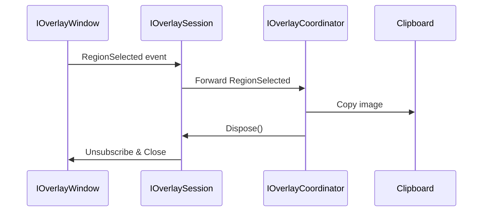

# Overlay System Architecture

## Overview

Overlay system provides transparent screenshot windows with annotation support. Architecture uses **Coordinator Pattern** to abstract platform differences (Windows single virtual desktop vs macOS per-screen overlays).

## Core Components

### 1. High-Level API

#### Direct Coordinator Access
Screenshot operations now use `IOverlayCoordinator` directly:
```csharp
public interface IOverlayCoordinator
{
    Task<IOverlaySession> StartSessionAsync();
    void CloseCurrentSession();
    bool HasActiveSession { get; }
}
```

**Usage**: Services like `HotkeyManager` and `SystemTrayService` call `IOverlayCoordinator` directly

### 2. Coordinator Layer

#### IOverlayCoordinator
Orchestrates platform-specific overlay session creation:
```csharp
public interface IOverlayCoordinator
{
    Task<IOverlaySession> StartSessionAsync();
    void CloseCurrentSession();
    bool HasActiveSession { get; }
}
```

**Implementations**:
- `WindowsOverlayCoordinator` - Single window covering virtual desktop
- `MacOverlayCoordinator` - Per-screen windows for Retina/permission handling

#### Template Method Pattern
`OverlayCoordinatorBase` standardizes session creation:
1. Get screens (`GetScreensAsync`)
2. Calculate target regions (`CalculateTargetRegions`)
3. Create windows (`CreateAndConfigureWindowsAsync`)
4. Show session

### 3. Session Management

#### IOverlaySession
Manages lifecycle and events for a single screenshot operation:
```csharp
public interface IOverlaySession : IDisposable
{
    // Window lifecycle
    void AddWindow(Window window);
    void RemoveWindow(Window window);
    IReadOnlyList<Window> Windows { get; }
    void ShowAll();
    void CloseAll();
    
    // Event forwarding (session aggregates all window events)
    event Action<RegionSelectedEventArgs>? RegionSelected;
    event Action<OverlayCancelledEventArgs>? Cancelled;
}
```

**Features**:
- **Lifecycle management**: Owns and manages overlay windows
- **Event aggregation**: Forwards window events to coordinator
- **Automatic cleanup**: Disposes resources and unsubscribes events
- **Thread-safe**: Lock-based concurrency control

**Event Flow**:
```
Window.RegionSelected → Session.RegionSelected → Coordinator.OnRegionSelected
Window.Cancelled → Session.Cancelled → Coordinator.OnCancelled
```

### 4. Window Layer

#### IOverlayWindow
Interface for overlay windows (enables DI and testing):
```csharp
public interface IOverlayWindow
{
    // Window basics
    PixelPoint Position { get; set; }
    double Width { get; set; }
    double Height { get; set; }
    void Show();
    void Close();
    
    // Overlay configuration
    void SetMaskSize(double width, double height);
    void SetScreens(IReadOnlyList<Screen>? screens);
    void SetPrecapturedAvaloniaBitmap(Bitmap? bitmap);
    bool ElementDetectionEnabled { get; set; }
    
    // Events (subscribed by Session)
    event EventHandler<RegionSelectedEventArgs>? RegionSelected;
    event EventHandler<OverlayCancelledEventArgs>? Cancelled;
    
    // IOverlaySession compatibility
    Window AsWindow();
}
```

**Key Changes**:
- ❌ Removed `SetSession()` - Window no longer holds Session reference
- ✅ Events are subscribed by Session automatically when window is added

**Implementation**: `OverlayWindow` (Avalonia Window + annotation canvas)

**Factory**: `IOverlayWindowFactory` creates instances with DI dependencies

### 5. Platform Services

#### IScreenCoordinateMapper
Handles DPI scaling and coordinate transformations:
```csharp
public interface IScreenCoordinateMapper
{
    PixelRect MapToPhysicalRect(Rect logicalRect, Screen screen);
    Rect MapToLogicalRect(PixelRect physicalRect, Screen screen);
    (double scaleX, double scaleY) GetScaleFactor(Screen screen);
    Screen? GetScreenFromPoint(PixelPoint point, IReadOnlyList<Screen> screens);
}
```

**Implementations**:
- `WindowsCoordinateMapper` - Handles virtual desktop coordinates
- `MacCoordinateMapper` - Retina scaling adjustments

#### IScreenCaptureStrategy
Platform-specific screen capture:
```csharp
public interface IScreenCaptureStrategy
{
    Task<SKBitmap?> CaptureRegionAsync(PixelRect region);
    Task<SKBitmap?> CaptureFullScreenAsync(Screen screen);
}
```

## Architecture Layers

```
┌─────────────────────────────────────────┐
│    IScreenshotService (High-Level)      │  User-facing API
├─────────────────────────────────────────┤
│    IOverlayCoordinator (Orchestration)  │  Platform abstraction
│    ├─ WindowsOverlayCoordinator         │
│    └─ MacOverlayCoordinator             │
├─────────────────────────────────────────┤
│    IOverlaySession (Lifecycle)          │  Session management
├─────────────────────────────────────────┤
│    IOverlayWindow (UI)                  │  Window implementation
│    └─ OverlayWindow (Avalonia)          │
├─────────────────────────────────────────┤
│    Platform Services                     │  Coordinate/Capture/Clipboard
│    ├─ IScreenCoordinateMapper           │
│    ├─ IScreenCaptureStrategy            │
│    └─ IClipboardStrategy                │
└─────────────────────────────────────────┘
```

## Platform Differences

### Windows Strategy
- **Single overlay window** covering entire virtual desktop
- Handles negative coordinates for multi-monitor layouts
- Uses `CalculateVirtualDesktopBounds()` to get bounding box
- High performance with Win32 BitBlt

### macOS Strategy
- **Per-screen overlay windows** due to:
  - Retina display scaling issues
  - Screen Recording permission per-space
  - Window server restrictions
- Each window positioned on individual screen bounds
- Requires Screen Recording permission

## Event Flow

### Session Creation and Event Subscription


### Event Forwarding Flow


## Service Registration

```csharp
// High-level API
services.AddSingleton<IScreenshotService, ScreenshotService>();

// Coordinator (platform-specific)
if (RuntimeInformation.IsOSPlatform(OSPlatform.Windows))
    services.AddSingleton<IOverlayCoordinator, WindowsOverlayCoordinator>();
else if (RuntimeInformation.IsOSPlatform(OSPlatform.OSX))
    services.AddSingleton<IOverlayCoordinator, MacOverlayCoordinator>();

// Session factory
services.AddSingleton<IOverlaySessionFactory, OverlaySessionFactory>();

// Window factory
services.AddSingleton<IOverlayWindowFactory, OverlayWindowFactory>();

// Platform services (Transient)
services.AddTransient<IScreenCoordinateMapper, WindowsCoordinateMapper>();
services.AddTransient<IScreenCaptureStrategy, WindowsScreenCaptureStrategy>();
```

## Key Design Decisions

### 1. Why Coordinator Pattern?
- **Platform isolation**: Windows vs macOS require fundamentally different approaches
- **Testability**: Easy to mock `IOverlayCoordinator` without creating actual windows
- **Extensibility**: Add new platform without touching core logic

### 2. Why IOverlayWindow Interface?
- **DI support**: Factory pattern for window creation
- **Testability**: Cannot mock `Avalonia.Controls.Window` (requires UI platform)
- **Type safety**: `AsWindow()` method for explicit conversion to base `Window` type

### 3. Why Template Method in Coordinator?
- **Code reuse**: Shared session creation flow across platforms
- **Flexibility**: Platform-specific logic in `CalculateTargetRegions` and `CreateAndConfigureWindowsAsync`
- **Maintainability**: Single source of truth for session lifecycle

### 4. Why Transient IScreenCoordinateMapper?
- **Fresh state**: Screen configuration can change (hot-plug monitors)
- **Session-scoped**: Each screenshot session gets current screen info
- **No caching**: Avoids stale screen data

## Testing Strategy

### Unit Tests
- Mock `IOverlayCoordinator` for `IScreenshotService` tests
- Mock `IOverlayWindow` for coordinator tests
- Test `OverlayCoordinatorBase` with concrete test implementation (no actual windows)

### Integration Tests
- Real window creation happens in production runtime only
- Cannot test `OverlayWindow` instantiation (requires IWindowingPlatform)
- Factory behavior tested without actual `Create()` calls

## File Locations

```
src/AGI.Kapster.Desktop/
├── Services/
│   ├── Screenshot/
│   │   ├── IScreenshotService.cs
│   │   └── ScreenshotService.cs
│   └── Overlay/
│       ├── Coordinators/
│       │   ├── IOverlayCoordinator.cs
│       │   ├── OverlayCoordinatorBase.cs
│       │   ├── WindowsOverlayCoordinator.cs
│       │   ├── MacOverlayCoordinator.cs
│       │   ├── IScreenCoordinateMapper.cs
│       │   ├── WindowsCoordinateMapper.cs
│       │   └── MacCoordinateMapper.cs
│       ├── State/
│       │   ├── IOverlaySession.cs
│       │   ├── OverlaySession.cs
│       │   ├── IOverlaySessionFactory.cs
│       │   └── OverlaySessionFactory.cs
│       ├── IOverlayWindowFactory.cs
│       └── OverlayWindowFactory.cs
└── Overlays/
    ├── IOverlayWindow.cs
    ├── OverlayWindow.axaml
    └── OverlayWindow.axaml.cs
```

## Performance Considerations

- **Window pre-capture**: Background image captured async for instant display
- **Session disposal**: Automatic cleanup prevents memory leaks
- **Transient services**: Fresh instances avoid stale cached data
- **DPI-aware rendering**: Adaptive DPI for high-quality annotation export

## Common Issues

### Issue: Window not covering all screens (multi-monitor)
**Cause**: Using `Bounds` instead of `ClientSize` for mask dimensions  
**Solution**: `UpdateMaskForSelection` uses `_maskSize` or `ClientSize` fallback

### Issue: Duplicate sessions on rapid screenshot triggers
**Cause**: No prevention mechanism for concurrent session creation  
**Solution**: Lock-based duplicate prevention in `OverlayCoordinatorBase.StartSessionAsync()`

### Issue: Saved image blurry
**Cause**: Fixed 96 DPI for RenderTargetBitmap  
**Solution**: Adaptive DPI based on target screen's `Scaling` property

### Issue: Tests fail with "Unable to locate IWindowingPlatform"
**Cause**: Trying to instantiate `OverlayWindow` in headless tests  
**Solution**: Mock `IOverlayWindow`, test factory structure without `Create()` calls
