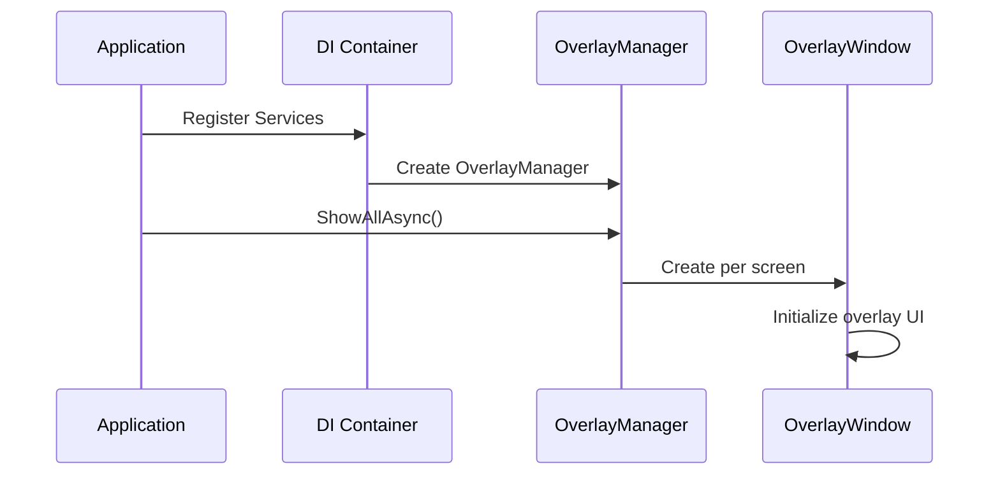
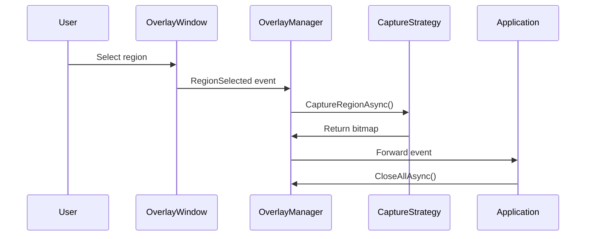
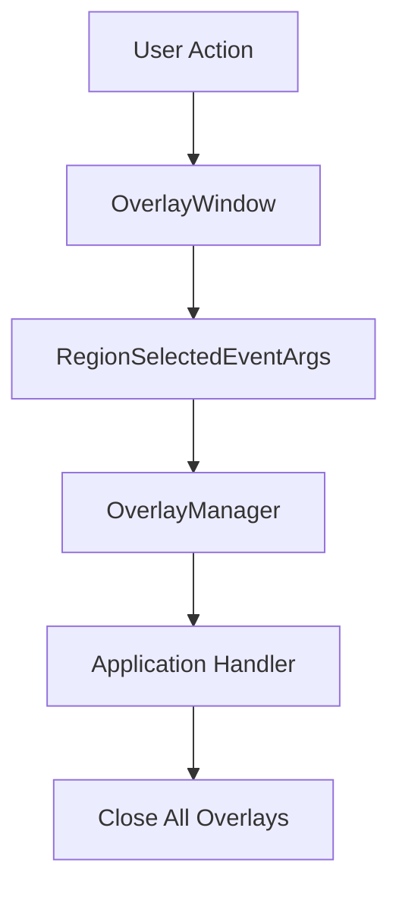

# Overlay System Architecture

## Overview

The overlay system in AGI.Captor provides transparent overlay windows for screen capture and annotation across multiple platforms. The architecture uses dependency injection without factory patterns, running purely in background mode with system tray integration.

## Core Components

### 1. Service Interfaces

#### IOverlayController
Primary interface for overlay lifecycle management:

```csharp
public interface IOverlayController
{
    Task ShowAllAsync();
    Task CloseAllAsync();
    bool IsActive { get; }
    event EventHandler<RegionSelectedEventArgs> RegionSelected;
    event EventHandler Cancelled;
}
```

**Implementation**: `SimplifiedOverlayManager`
- Manages overlay windows across all screens
- Coordinates multi-screen operations
- Handles event aggregation and forwarding

#### IOverlayWindow
Platform-specific overlay window interface:

```csharp
public interface IOverlayWindow
{
    Task ShowAsync();
    Task CloseAsync();
    Screen Screen { get; }
    bool IsVisible { get; }
    event EventHandler<RegionSelectedEventArgs> RegionSelected;
    event EventHandler Cancelled;
}
```

**Implementations**:
- `WindowsOverlayWindow` - Windows platform implementation
- `MacOverlayWindow` - macOS platform implementation

#### IScreenCaptureStrategy
Platform-specific screen capture implementation:

```csharp
public interface IScreenCaptureStrategy
{
    Task<SKBitmap> CaptureRegionAsync(PixelRect region);
    Task<SKBitmap> CaptureFullScreenAsync(Screen screen);
    Task<SKBitmap> CaptureWindowAsync(IntPtr windowHandle);
    Task<SKBitmap> CaptureElementAsync(IElementInfo element);
}
```

**Implementations**:
- `WindowsScreenCaptureStrategy` - Uses Win32 BitBlt API
- `MacScreenCaptureStrategy` - Uses screencapture command

## Architecture Flow

### 1. Initialization


### 2. Capture Workflow


### 3. Event Propagation


## Platform Implementations

### Windows Implementation

#### WindowsOverlayWindow
```csharp
public class WindowsOverlayWindow : IOverlayWindow
{
    private readonly IScreenCaptureStrategy _captureStrategy;
    private readonly IElementDetector _elementDetector;
    private OverlayWindow _avaloniaWindow;

    public async Task ShowAsync()
    {
        _avaloniaWindow = new OverlayWindow
        {
            DataContext = new OverlayViewModel(_captureStrategy, _elementDetector)
        };
        
        // Configure for Windows-specific behavior
        _avaloniaWindow.WindowState = WindowState.Maximized;
        _avaloniaWindow.Topmost = true;
        _avaloniaWindow.ShowInTaskbar = false;
        
        _avaloniaWindow.Show();
        await _avaloniaWindow.WaitForLoadedAsync();
    }
}
```

#### WindowsScreenCaptureStrategy
```csharp
public class WindowsScreenCaptureStrategy : IScreenCaptureStrategy
{
    public async Task<SKBitmap> CaptureRegionAsync(PixelRect region)
    {
        var hdc = GetDC(IntPtr.Zero);
        var memDc = CreateCompatibleDC(hdc);
        var bitmap = CreateCompatibleBitmap(hdc, region.Width, region.Height);
        
        SelectObject(memDc, bitmap);
        BitBlt(memDc, 0, 0, region.Width, region.Height, hdc, region.X, region.Y, SRCCOPY);
        
        return ConvertToSKBitmap(bitmap);
    }
}
```

### macOS Implementation

#### MacOverlayWindow
```csharp
public class MacOverlayWindow : IOverlayWindow
{
    public async Task ShowAsync()
    {
        _avaloniaWindow = new OverlayWindow();
        
        // macOS-specific configuration
        _avaloniaWindow.SystemDecorations = SystemDecorations.None;
        _avaloniaWindow.Background = Brushes.Transparent;
        _avaloniaWindow.WindowState = WindowState.FullScreen;
        
        _avaloniaWindow.Show();
        await EnsureProperScreenCoverage();
    }
    
    private async Task EnsureProperScreenCoverage()
    {
        // Handle macOS multi-screen black screen issue
        var screens = Screen.AllScreens;
        foreach (var screen in screens)
        {
            await ValidateScreenCoverage(screen);
        }
    }
}
```

#### MacScreenCaptureStrategy
```csharp
public class MacScreenCaptureStrategy : IScreenCaptureStrategy
{
    public async Task<SKBitmap> CaptureRegionAsync(PixelRect region)
    {
        var tempFile = Path.GetTempFileName() + ".png";
        var process = new Process
        {
            StartInfo = new ProcessStartInfo
            {
                FileName = "screencapture",
                Arguments = $"-R {region.X},{region.Y},{region.Width},{region.Height} {tempFile}",
                UseShellExecute = false,
                CreateNoWindow = true
            }
        };
        
        process.Start();
        await process.WaitForExitAsync();
        
        return SKBitmap.Decode(tempFile);
    }
}
```

## Service Registration

### Dependency Injection Setup
```csharp
// Program.cs
public static void ConfigureServices(IServiceCollection services)
{
    // Core services
    services.AddSingleton<IOverlayController, SimplifiedOverlayManager>();
    
    // Platform-specific services
    if (RuntimeInformation.IsOSPlatform(OSPlatform.Windows))
    {
        services.AddTransient<IOverlayWindow, WindowsOverlayWindow>();
        services.AddTransient<IScreenCaptureStrategy, WindowsScreenCaptureStrategy>();
        services.AddTransient<IElementDetector, WindowsElementDetector>();
    }
    else if (RuntimeInformation.IsOSPlatform(OSPlatform.OSX))
    {
        services.AddTransient<IOverlayWindow, MacOverlayWindow>();
        services.AddTransient<IScreenCaptureStrategy, MacScreenCaptureStrategy>();
        services.AddTransient<IElementDetector, MacElementDetector>();
    }
    
    // Shared services
    services.AddSingleton<IClipboardStrategy, PlatformClipboardStrategy>();
    services.AddSingleton<ISettingsService, SettingsService>();
}
```

### Factory Pattern Removal

Previous architecture used factory pattern which was removed for simplification:

```csharp
// REMOVED: Unnecessary factory abstraction
public interface IPlatformOverlayFactory
{
    IOverlayWindow CreateOverlayWindow();
    IElementDetector CreateElementDetector();
}

// CURRENT: Direct dependency injection
services.AddTransient<IOverlayWindow, WindowsOverlayWindow>();
services.AddTransient<IElementDetector, WindowsElementDetector>();
```

## Event System

### Event Flow Architecture
```csharp
public class RegionSelectedEventArgs : EventArgs
{
    public PixelRect Region { get; }
    public SKBitmap? CapturedImage { get; }
    public bool IsEditableSelection { get; }
    public DateTime Timestamp { get; }
}
```

### Event Handling Pattern
```csharp
public class SimplifiedOverlayManager : IOverlayController
{
    public event EventHandler<RegionSelectedEventArgs> RegionSelected;
    
    private void OnOverlayRegionSelected(object sender, RegionSelectedEventArgs e)
    {
        // Forward event to application level
        RegionSelected?.Invoke(this, e);
        
        // Auto-close unless editable selection
        if (!e.IsEditableSelection)
        {
            _ = CloseAllAsync();
        }
    }
}
```

## Multi-Screen Support

### Screen Enumeration
```csharp
public async Task ShowAllAsync()
{
    var screens = Screen.AllScreens;
    var overlayTasks = screens.Select(async screen =>
    {
        var overlay = _serviceProvider.GetRequiredService<IOverlayWindow>();
        overlay.Screen = screen;
        await overlay.ShowAsync();
        
        // Subscribe to events
        overlay.RegionSelected += OnOverlayRegionSelected;
        overlay.Cancelled += OnOverlayCancelled;
        
        return overlay;
    });
    
    _activeOverlays = await Task.WhenAll(overlayTasks);
}
```

### Screen Coordinate Handling
```csharp
public PixelRect TranslateToGlobalCoordinates(PixelRect localRect, Screen screen)
{
    return new PixelRect(
        localRect.X + screen.Bounds.X,
        localRect.Y + screen.Bounds.Y,
        localRect.Width,
        localRect.Height
    );
}
```

## Performance Considerations

### Memory Management
- Overlay windows disposed properly on close
- Bitmaps released after use
- Event handlers unsubscribed on cleanup

### Rendering Optimization
- Hardware acceleration enabled where available
- Minimize overlay redraw operations
- Efficient bitmap handling and conversion

### Platform-Specific Optimizations
- **Windows**: DirectX rendering where possible
- **macOS**: Metal rendering integration
- **Cross-platform**: Skia GPU acceleration

## Error Handling

### Platform Capability Detection
```csharp
public bool CanCaptureElements()
{
    return RuntimeInformation.IsOSPlatform(OSPlatform.Windows);
}

public async Task<SKBitmap> CaptureElementAsync(IElementInfo element)
{
    if (!CanCaptureElements())
    {
        throw new PlatformNotSupportedException("Element capture not supported on this platform");
    }
    
    return await _elementDetector.CaptureElementAsync(element);
}
```

### Graceful Degradation
```csharp
public async Task<IEnumerable<IElementInfo>> DetectElementsAsync()
{
    try
    {
        return await _elementDetector.DetectElementsAsync();
    }
    catch (PlatformNotSupportedException)
    {
        // Fall back to manual region selection
        return Enumerable.Empty<IElementInfo>();
    }
}
```

## Testing Strategy

### Interface Mocking
```csharp
[Test]
public async Task ShowAllAsync_ShouldCreateOverlayForEachScreen()
{
    // Arrange
    var mockOverlay = Substitute.For<IOverlayWindow>();
    var mockServiceProvider = Substitute.For<IServiceProvider>();
    mockServiceProvider.GetRequiredService<IOverlayWindow>().Returns(mockOverlay);
    
    var manager = new SimplifiedOverlayManager(mockServiceProvider);
    
    // Act
    await manager.ShowAllAsync();
    
    // Assert
    mockServiceProvider.Received(Screen.AllScreens.Length).GetRequiredService<IOverlayWindow>();
}
```

### Integration Testing
```csharp
[Test]
public async Task EndToEndCaptureWorkflow()
{
    // Arrange
    var services = new ServiceCollection();
    ConfigureTestServices(services);
    var provider = services.BuildServiceProvider();
    
    var overlayManager = provider.GetRequiredService<IOverlayController>();
    
    // Act
    await overlayManager.ShowAllAsync();
    
    // Simulate user selection
    var testRegion = new PixelRect(100, 100, 200, 200);
    // Trigger selection event
    
    // Assert
    Assert.That(overlayManager.IsActive, Is.False);
}
```

## Troubleshooting

### Common Issues

#### macOS Black Screen
- **Problem**: Secondary monitors show black overlay
- **Solution**: Proper screen enumeration and window positioning
- **Implementation**: Enhanced screen coverage validation

#### Windows UI Automation Failures
- **Problem**: Element detection fails on some applications
- **Solution**: Fallback to manual region selection
- **Implementation**: Graceful degradation pattern

#### Event Handler Memory Leaks
- **Problem**: Event handlers not unsubscribed
- **Solution**: Proper disposal pattern implementation
- **Implementation**: Using statement and explicit cleanup

### Debugging Tools
```csharp
public class OverlayDebugger
{
    public void LogScreenConfiguration()
    {
        foreach (var screen in Screen.AllScreens)
        {
            Console.WriteLine($"Screen: {screen.DeviceName}, Bounds: {screen.Bounds}, Primary: {screen.Primary}");
        }
    }
    
    public void ValidateEventSubscriptions()
    {
        // Check for memory leaks in event subscriptions
    }
}
```