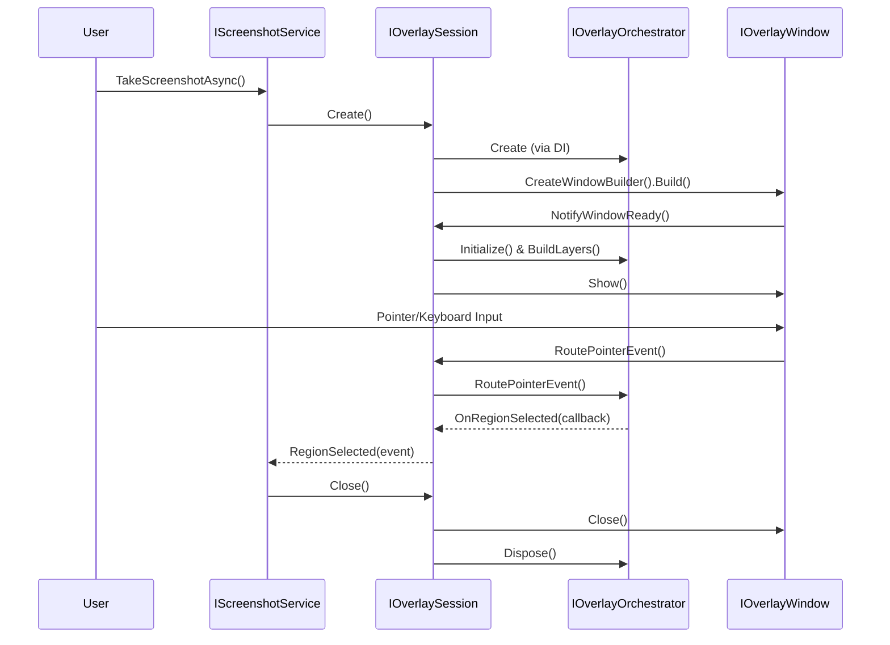

# Overlay System Architecture

## Overview

Overlay system provides transparent screenshot windows with annotation support. Architecture uses **Coordinator Pattern** to abstract platform differences (Windows single virtual desktop vs macOS per-screen overlays).

## Core Components

### 1. High-Level API

#### IScreenshotService
Entry point for screenshot operations:
```csharp
public interface IScreenshotService
{
    bool IsActive { get; }
    Task TakeScreenshotAsync();
    void Cancel();
}
```

**Implementation**: Platform-specific services implementing full session lifecycle

**Implementations**:
- `WindowsScreenshotService` - Single window covering virtual desktop
- `MacScreenshotService` - Per-screen windows for Retina/permission handling

#### Template Method Pattern
`ScreenshotServiceBase` standardizes session creation:
1. Get screens (`GetScreensAsync`)
2. Calculate target regions (`CalculateTargetRegions`)
3. Create windows (`CreateAndConfigureWindowsAsync`)
4. Show session

### 3. Session Management (Core Coordinator)

#### IOverlaySession
**Central coordinator** for a complete screenshot operation session. All operations start from Session and end at Session.

```csharp
public interface IOverlaySession : IDisposable
{
    // Window lifecycle
    IOverlayWindowBuilder CreateWindowBuilder();
    void AddWindow(Window window);
    IReadOnlyList<Window> Windows { get; }
    void ShowAll();
    void Close();
    
    // Input routing (from Window to Orchestrator)
    void RoutePointerEvent(PointerEventArgs e);
    void RouteKeyEvent(KeyEventArgs e);
    
    // Window lifecycle notifications
    void NotifyWindowReady(IOverlayWindow window);
    
    // Selection state coordination
    bool CanStartSelection(object window);
    void SetSelection(object window);
    void ClearSelection(object? window = null);
    bool HasSelection { get; }
    
    // Event notifications
    void NotifyRegionSelected(object? sender, RegionSelectedEventArgs e);
    event EventHandler<RegionSelectedEventArgs>? RegionSelected;
}
```

**Key Responsibilities**:
1. **Orchestrator ownership**: Creates and holds `IOverlayOrchestrator` instance
2. **Window management**: Creates, initializes, and manages `IOverlayWindow` instances
3. **Input routing**: Routes all UI events from Window to Orchestrator
4. **Business coordination**: Handles high-level screenshot workflow logic
5. **State management**: Centralized selection state and element highlighting

**Architecture Pattern**: Session → Orchestrator → Layers (unidirectional dependency)

### 4. Orchestrator Layer (Layer Coordinator)

#### IOverlayOrchestrator
**Layer management facade** - owned by Session, manages drawing layers and coordinates events.

```csharp
public interface IOverlayOrchestrator : IDisposable
{
    // Initialization
    void Initialize(TopLevel window, ILayerHost host, Size maskSize);
    void BuildLayers();
    void PublishContextChanged(Size overlaySize, PixelPoint overlayPosition, IReadOnlyList<Screen>? screens);
    
    // Input routing (called by Session)
    bool RouteKeyEvent(KeyEventArgs e);
    bool RoutePointerEvent(PointerEventArgs e);
    
    // Background management
    void SetFrozenBackground(Bitmap? background);
    void SetScreens(IReadOnlyList<Screen>? screens);
    Task<Bitmap?> GetFullScreenScreenshotAsync(Size bounds);
    
    // Callback-based notifications (no reverse dependency on Session)
    Action<object?, RegionSelectedEventArgs>? OnRegionSelected { get; set; }
    Action<string>? OnCancelled { get; set; }
}
```

**Key Changes from Previous Architecture**:
- ❌ Removed `event EventHandler<RegionSelectedEventArgs>? RegionSelected` (replaced with callback)
- ❌ Removed `SetSession(IOverlaySession session)` (no reverse dependency)
- ✅ Added callback properties for notifying Session without coupling

**Implementation**: `OverlayOrchestrator` encapsulates:
- `OverlayContextProvider` - Builds/updates `IOverlayContext` from window state
- `InputRouter` - Routes keyboard/pointer events through `IOverlayLayerManager`
- `OverlayEventCoordinator` - Subscribes to `IOverlayEventBus` and coordinates high-level actions
- `IOverlayActionHandler` - Centralizes Confirm/Export/Cancel actions
- Layer creation (Mask/Selection/Annotation/Toolbar)

**Lifetime**: Transient (one per window), created and owned by Session

### 5. Window Layer (Pure UI Container)

#### IOverlayWindow
**Minimal UI container** - delegates all logic to Session, no business logic.

```csharp
public interface IOverlayWindow
{
    // Window basics
    PixelPoint Position { get; set; }
    double Width { get; set; }
    double Height { get; set; }
    void Show();
    void Close();
    
    // Configuration (called by Session/WindowBuilder)
    void SetPrecapturedAvaloniaBitmap(Bitmap? bitmap);
    void SetMaskSize(double width, double height);
    void SetSession(IOverlaySession? session);  // Reverse reference for event delegation
    void SetScreens(IReadOnlyList<Screen>? screens);
    
    // Session accessors (for initialization)
    ILayerHost? GetLayerHost();
    Size GetMaskSize();
    TopLevel AsTopLevel();
    
    // IOverlaySession compatibility
    Window AsWindow();
}
```

**Key Changes from Previous Architecture**:
- ❌ Removed `event EventHandler<RegionSelectedEventArgs>? RegionSelected` (no events, delegates to Session)
- ❌ Removed `bool ElementDetectionEnabled { get; set; }` (dead code)
- ✅ Simplified to pure UI container
- ✅ All input events delegated to Session via `_session.RoutePointerEvent/RouteKeyEvent`

**Implementation**: `OverlayWindow` (Avalonia Window + XAML)
- No longer injects `IOverlayOrchestrator` in constructor
- Only holds reverse reference to `IOverlaySession`
- Delegates all input events to Session

**Creation**: Created by `OverlayWindowBuilder` (owned by Session)

### 5. Platform Services

#### IScreenCoordinateMapper
Handles DPI scaling and coordinate transformations:
```csharp
public interface IScreenCoordinateMapper
{
    PixelRect MapToPhysicalRect(Rect logicalRect, Screen screen);
    Rect MapToLogicalRect(PixelRect physicalRect, Screen screen);
    (double scaleX, double scaleY) GetScaleFactor(Screen screen);
    Screen? GetScreenFromPoint(PixelPoint point, IReadOnlyList<Screen> screens);
}
```

**Implementations**:
- `WindowsCoordinateMapper` - Handles virtual desktop coordinates
- `MacCoordinateMapper` - Retina scaling adjustments

#### IScreenCaptureStrategy
Platform-specific screen capture:
```csharp
public interface IScreenCaptureStrategy
{
    Task<SKBitmap?> CaptureRegionAsync(PixelRect region);
    Task<SKBitmap?> CaptureFullScreenAsync(Screen screen);
}
```

## Architecture Layers (Session-Centric Design)

```
┌────────────────────────────────────────────────────┐
│  IScreenshotService (User-Facing API)              │  Entry point
│  - TakeScreenshotAsync()                           │
│  - Cancel()                                        │
└──────────────────┬─────────────────────────────────┘
                   │ creates
                   ↓
┌────────────────────────────────────────────────────┐
│  IOverlaySession (Central Coordinator) ⭐          │  Session owner
│  - Holds: IOverlayOrchestrator                     │
│  - Manages: List<IOverlayWindow>                   │
│  - Routes: All input events                        │
│  - Coordinates: High-level workflow                │
└──────────────────┬─────────────────────────────────┘
                   │ owns & controls
                   ↓
┌────────────────────────────────────────────────────┐
│  IOverlayOrchestrator (Layer Manager)              │  Drawing coordinator
│  - Manages: Layers (Mask/Selection/Annotation)     │
│  - Routes: Input to layers                         │
│  - Notifies: Session via callbacks                 │
│  - NO reverse dependency on Session ✅             │
└──────────────────┬─────────────────────────────────┘
                   │ manages
                   ↓
┌────────────────────────────────────────────────────┐
│  Layers (Drawing Logic)                            │  Rendering
│  - MaskLayer, SelectionLayer                       │
│  - AnnotationLayer, ToolbarLayer                   │
│  - Pure drawing and interaction logic              │
└────────────────────────────────────────────────────┘

                   ↑ input events
┌────────────────────────────────────────────────────┐
│  IOverlayWindow (UI Container)                     │  View layer
│  - Pure Avalonia Window (XAML)                     │
│  - Delegates ALL events → Session                  │
│  - NO business logic ✅                            │
│  - NO Orchestrator reference ✅                    │
└────────────────────────────────────────────────────┘
```

**Key Architectural Principles**:
1. ✅ **Unidirectional dependency**: Session → Orchestrator → Layers
2. ✅ **Single ownership**: Session creates and owns Orchestrator
3. ✅ **Event delegation**: Window → Session → Orchestrator → Layers
4. ✅ **Callback pattern**: Orchestrator notifies Session via callbacks (no reverse dependency)
5. ✅ **Pure UI container**: Window has zero business logic

## Platform Differences

### Windows Strategy
- **Single overlay window** covering entire virtual desktop
- Handles negative coordinates for multi-monitor layouts
- Uses `CalculateVirtualDesktopBounds()` to get bounding box
- High performance with Win32 BitBlt

### macOS Strategy
- **Per-screen overlay windows** due to:
  - Retina display scaling issues
  - Screen Recording permission per-space
  - Window server restrictions
- Each window positioned on individual screen bounds
- Requires Screen Recording permission

## Event Flow (Session-Centric)



**Key Flow Characteristics**:
1. Session creates and initializes Orchestrator
2. Session creates Windows via WindowBuilder
3. Window delegates all input to Session
4. Session routes input to Orchestrator
5. Orchestrator notifies Session via callbacks
6. Session fires events to Service

## Service Registration

```csharp
// Platform-specific screenshot service (implements full session lifecycle)
if (RuntimeInformation.IsOSPlatform(OSPlatform.Windows))
    services.AddSingleton<IScreenshotService, WindowsScreenshotService>();
else if (RuntimeInformation.IsOSPlatform(OSPlatform.OSX))
    services.AddSingleton<IScreenshotService, MacScreenshotService>();

// Session factory
services.AddSingleton<IOverlaySessionFactory, OverlaySessionFactory>();

// Window factory
services.AddSingleton<IOverlayWindowFactory, OverlayWindowFactory>();

// Overlay subsystems (via extension method)
services.AddOverlayServices(); // Registers EventBus, LayerManager, Orchestrator

// Platform services (Transient)
services.AddTransient<IScreenCoordinateMapper, WindowsCoordinateMapper>();
services.AddTransient<IScreenCaptureStrategy, WindowsScreenCaptureStrategy>();
```

## Key Design Decisions

### 1. Why Direct Service Implementation?
- **Simplified architecture**: Removed unnecessary abstraction layer (`IOverlayCoordinator`)
- **Platform isolation**: Windows vs macOS implementations as separate services
- **Testability**: Easy to mock `IScreenshotService` without creating actual windows
- **Naming clarity**: `WindowsScreenshotService` vs `WindowsOverlayCoordinator` better reflects responsibility

### 2. Why IOverlayWindow Interface?
- **DI support**: Factory pattern for window creation
- **Testability**: Cannot mock `Avalonia.Controls.Window` (requires UI platform)
- **Type safety**: `AsWindow()` method for explicit conversion to base `Window` type

### 3. Why Template Method in Screenshot Service?
- **Code reuse**: Shared session creation flow across platforms via `ScreenshotServiceBase`
- **Flexibility**: Platform-specific logic in `CalculateTargetRegions` and `CreateAndConfigureWindowsAsync`
- **Maintainability**: Single source of truth for session lifecycle

### 4. Why Transient IScreenCoordinateMapper?
- **Fresh state**: Screen configuration can change (hot-plug monitors)
- **Session-scoped**: Each screenshot session gets current screen info

### 5. Why IOverlayOrchestrator Facade?
- **Separation of Concerns**: `OverlayWindow` focuses on UI lifecycle, not overlay subsystems
- **Single Responsibility**: Orchestrator owns layer creation, input routing, context management
- **Simplified DI**: `OverlayWindow` constructor has NO dependencies (pure UI container)
- **Testability**: Mock orchestrator to test window behavior without layer complexity

### 6. Why Session-Centric Architecture?
- **Clear ownership**: Session owns the entire screenshot workflow from start to finish
- **Unidirectional dependency**: Session → Orchestrator → Layers (no circular dependencies)
- **Centralized coordination**: All business logic in Session, not scattered across components
- **Pure UI separation**: Window is purely a UI container with zero business logic
- **Callback pattern**: Orchestrator uses callbacks instead of events to notify Session (decoupling)
- **Simplified lifecycle**: Session controls creation and initialization of all components

## Testing Strategy

### Unit Tests
- Mock `IOverlayCoordinator` for `IScreenshotService` tests
- Mock `IOverlayWindow` for coordinator tests
- Test `OverlayCoordinatorBase` with concrete test implementation (no actual windows)

### Integration Tests
- Real window creation happens in production runtime only
- Cannot test `OverlayWindow` instantiation (requires IWindowingPlatform)
- Factory behavior tested without actual `Create()` calls

## File Locations

```
src/AGI.Kapster.Desktop/
├── Services/
│   ├── Screenshot/
│   │   ├── IScreenshotService.cs
│   │   └── ScreenshotService.cs
│   └── Overlay/
│       ├── Coordinators/
│       │   ├── IOverlayCoordinator.cs
│       │   ├── OverlayCoordinatorBase.cs
│       │   ├── WindowsOverlayCoordinator.cs
│       │   ├── MacOverlayCoordinator.cs
│       │   ├── IScreenCoordinateMapper.cs
│       │   ├── WindowsCoordinateMapper.cs
│       │   └── MacCoordinateMapper.cs
│       ├── State/
│       │   ├── IOverlaySession.cs
│       │   ├── OverlaySession.cs
│       │   ├── IOverlaySessionFactory.cs
│       │   └── OverlaySessionFactory.cs
│       ├── IOverlayWindowFactory.cs
│       └── OverlayWindowFactory.cs
└── Overlays/
    ├── IOverlayWindow.cs
    ├── OverlayWindow.axaml
    └── OverlayWindow.axaml.cs
```

## Performance Considerations

- **Window pre-capture**: Background image captured async for instant display
- **Session disposal**: Automatic cleanup prevents memory leaks
- **Transient services**: Fresh instances avoid stale cached data
- **DPI-aware rendering**: Adaptive DPI for high-quality annotation export

## Common Issues

### Issue: Window not covering all screens (multi-monitor)
**Cause**: Using `Bounds` instead of `ClientSize` for mask dimensions  
**Solution**: `UpdateMaskForSelection` uses `_maskSize` or `ClientSize` fallback

### Issue: Second screenshot fails to draw selection
**Cause**: Static `GlobalSelectionState` not reset  
**Solution**: Session-scoped state via `IOverlaySession`, auto-cleared on window removal

### Issue: Saved image blurry
**Cause**: Fixed 96 DPI for RenderTargetBitmap  
**Solution**: Adaptive DPI based on target screen's `Scaling` property

### Issue: Tests fail with "Unable to locate IWindowingPlatform"
**Cause**: Trying to instantiate `OverlayWindow` in headless tests  
**Solution**: Mock `IOverlayWindow`, test factory structure without `Create()` calls
