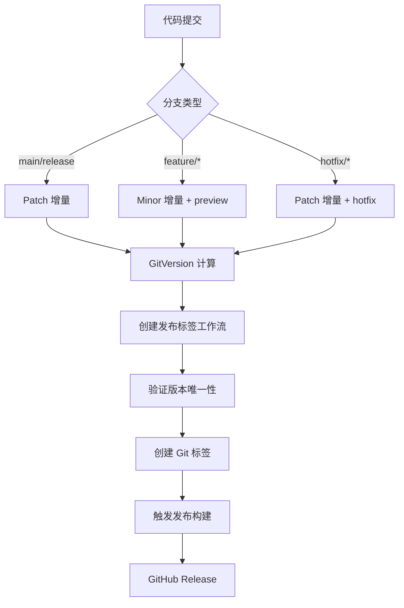

# AGI.Captor 版本策略与 GitVersion 集成指南

## 📋 概述

AGI.Captor 采用基于 GitVersion 的智能版本计算策略，通过分析 Git 分支、提交历史和标签来自动生成符合语义化版本规范的版本号，并与 GitHub Actions 实现全自动化发布流程。

## 🔧 GitVersion 配置

### 核心配置 (`GitVersion.yml`)

```yaml
mode: ContinuousDelivery
assembly-versioning-scheme: MajorMinorPatch
assembly-file-versioning-scheme: MajorMinorPatchTag

branches:
  main:
    mode: ContinuousDelivery
    tag: ''
    increment: Patch
  release:
    mode: ContinuousDelivery
    tag: ''
    increment: Patch
  feature:
    mode: ContinuousDelivery
    tag: 'preview'
    increment: Minor
  hotfix:
    mode: ContinuousDelivery
    tag: 'hotfix'
    increment: Patch
```

### 版本计算逻辑

1. **基础版本**: 从最近的版本标签开始
2. **分支策略**: 根据分支类型确定增量和标签
3. **提交分析**: 解析 Conventional Commits 影响版本类型
4. **预发布标识**: 自动添加分支相关的预发布标签

## 🌿 分支策略

### 分支类型和版本规则

| 分支类型 | 分支模式 | 版本增量 | 标签格式 | 示例版本 |
|---------|---------|---------|---------|---------|
| **main** | `main`, `master` | Patch | `X.Y.Z` | `1.2.3` |
| **release** | `release` | Patch | `X.Y.Z` | `1.2.3` |
| **feature** | `feature/*`, `features/*` | Minor | `X.Y.Z-preview.N` | `1.3.0-preview.1` |
| **hotfix** | `hotfix/*`, `hotfixes/*` | Patch | `X.Y.Z-hotfix.N` | `1.2.4-hotfix.1` |

### 自动化工作流集成



### 分支工作流程

```mermaid
gitgraph
    commit id: "Initial"
    branch main
    commit id: "v1.2.0" tag: "v1.2.0"
    branch feature/new-ui
    commit id: "UI Work 1"
    commit id: "UI Work 2"
    checkout main
    merge feature/new-ui
    commit id: "v1.3.0" tag: "v1.3.0"
    branch hotfix/security-fix  
    commit id: "Security patch"
    checkout main
    merge hotfix/security-fix
    commit id: "v1.3.1" tag: "v1.3.1"
```

## 🏷️ 版本号格式

### 语义化版本 (SemVer)
```
主版本.次版本.修订版本[-预发布标识符][+构建元数据]
```

### 版本号示例

| 场景 | 版本格式 | 示例 |
|------|---------|------|
| 正式发布 | `X.Y.Z` | `1.3.0` |
| 预发布 | `X.Y.Z-preview.N` | `1.3.0-preview.1` |
| 热修复 | `X.Y.Z-hotfix.N` | `1.2.4-hotfix.1` |
| 开发构建 | `X.Y.Z-preview.N+Sha.abcd123` | `1.3.0-preview.1+Sha.abc1234` |

## 📝 Conventional Commits 集成

### 提交消息格式影响版本计算

GitVersion 可以解析 Conventional Commits 格式来智能确定版本增量：

```bash
# 功能增加 → Minor 版本增量
feat(ui): add new dashboard layout
# 1.2.3 → 1.3.0

# 问题修复 → Patch 版本增量  
fix(auth): resolve login timeout issue
# 1.2.3 → 1.2.4

# 破坏性变更 → Major 版本增量
feat(api)!: redesign REST endpoints
# 或在提交正文中包含 "BREAKING CHANGE:"
# 1.2.3 → 2.0.0
```

### 支持的提交类型

| 类型 | 版本影响 | 说明 |
|------|---------|------|
| `feat:` | Minor | 新功能 |
| `fix:` | Patch | 错误修复 |
| `!` 后缀或 `BREAKING CHANGE:` | Major | 破坏性变更 |
| `chore:`, `docs:`, `style:` | None | 不影响版本号 |
# 主版本增量 (破坏性变更)
git commit -m "feat: new API +semver:breaking"
git commit -m "refactor: change interface +semver:major"

# 次版本增量 (新功能)
git commit -m "feat: add auto-update +semver:feature"
git commit -m "feat: new overlay system +semver:minor"

# 修订版本增量 (错误修复)
git commit -m "fix: memory leak issue +semver:fix"
git commit -m "fix: crash on startup +semver:patch"

# 不增量版本
git commit -m "docs: update README +semver:none"
git commit -m "ci: update workflow +semver:skip"
```

## 🔧 常用命令

### GitVersion 相关命令

```powershell
# 获取当前版本信息
dotnet gitversion

# 获取特定版本字段
dotnet gitversion /showvariable SemVer
dotnet gitversion /showvariable FullSemVer
dotnet gitversion /showvariable InformationalVersion

# 输出详细调试信息
dotnet gitversion /verbosity Diagnostic

# 更新程序集版本信息
dotnet gitversion /updateassemblyinfo
```

### 构建系统命令

```powershell
# 获取构建信息（包含版本）
./build.ps1 Info

# 清理构建输出
./build.ps1 Clean

# 构建项目
./build.ps1 Build

# 运行测试
./build.ps1 Test

# 运行测试并生成覆盖率报告
./build.ps1 Test --coverage

# 发布应用（指定平台）
./build.ps1 Publish --rids win-x64,linux-x64,osx-x64

# 创建安装包
./build.ps1 Package

# 完整的CI构建流程
./build.ps1 Clean Build Test Publish Package
```

### Git 标签和发布

```bash
# 创建特定版本标签（推荐方式）
git tag v1.4.0
git push origin v1.4.0  # 使用标签版本发布

# 查看所有标签
git tag -l

# 删除标签（如果需要）
git tag -d v1.4.0
git push origin :refs/tags/v1.4.0
```

**发布策略说明**:
- **标签发布**: 创建版本标签进行精确版本控制（推荐）
- **手动触发**: 在 GitHub Actions 页面手动触发发布

## 🚀 CI/CD 工作流程

### 开发流程 (main分支)
1. **推送到main分支** → 触发 `ci.yml`
2. **自动构建测试** → 生成预览版本
3. **安全扫描** → CodeQL 分析
4. **版本格式**: `1.3.0-alpha.X+sha`

### 发布流程 (版本标签)
1. **方式一: 标签发布** 
   ```bash
   git tag v1.4.0
   git push origin v1.4.0  # 使用指定版本发布
   ```
2. **方式二: 手动触发** → GitHub Actions 页面手动触发
3. **自动构建** → 跨平台构建 (Windows/macOS/Linux)
4. **自动发布** → 创建 GitHub Release
5. **版本格式**: `1.4.0` (正式版本)

**注意**: 不再支持通过推送 release 分支触发发布，必须使用标签或手动触发。

**详细发布流程请参考**: [Release Workflow Guide](./release-workflow.md)

## 📊 版本信息获取

### PowerShell 脚本示例

```powershell
# 获取版本信息的脚本
function Get-VersionInfo {
    $version = dotnet gitversion | ConvertFrom-Json
    
    Write-Host "🏷️ 版本信息"
    Write-Host "=============="
    Write-Host "SemVer: $($version.SemVer)"
    Write-Host "FullSemVer: $($version.FullSemVer)"
    Write-Host "InformationalVersion: $($version.InformationalVersion)"
    Write-Host "AssemblySemVer: $($version.AssemblySemVer)"
    Write-Host "BranchName: $($version.BranchName)"
    Write-Host "Sha: $($version.Sha)"
    Write-Host "ShortSha: $($version.ShortSha)"
    
    return $version
}

# 使用示例
$versionInfo = Get-VersionInfo
```

### 在代码中获取版本

```csharp
// 在 .NET 应用中获取版本信息
using System.Reflection;

// 获取程序集版本
var assembly = Assembly.GetExecutingAssembly();
var version = assembly.GetName().Version;
var informationalVersion = assembly
    .GetCustomAttribute<AssemblyInformationalVersionAttribute>()
    ?.InformationalVersion;

Console.WriteLine($"Version: {version}");
Console.WriteLine($"Informational: {informationalVersion}");
```

## 🔍 故障排除

### 常见问题和解决方案

#### 1. GitVersion 工具问题
```bash
# 安装 GitVersion 工具
dotnet tool install --global GitVersion.Tool --version 5.12.0

# 验证安装
dotnet tool list --global | grep gitversion

# 更新工具
dotnet tool update --global GitVersion.Tool
```

#### 2. 版本计算错误
```bash
# 检查 GitVersion 配置
dotnet gitversion /showconfig

# 详细诊断信息
dotnet gitversion /verbosity diagnostic

# 查看特定版本变量
dotnet gitversion /showvariable SemVer
dotnet gitversion /showvariable FullSemVer
```

#### 3. 分支策略问题
```bash
# 检查当前分支状态
git branch -v
git status

# 查看最近的标签
git tag -l --sort=-version:refname | head -5

# 检查分支历史
git log --oneline --graph -10
```

#### 4. 版本号重复
```bash
# 查看现有标签
git tag -l | sort -V

# 删除错误的标签
git tag -d v1.2.3
git push origin :refs/tags/v1.2.3
```

### 调试工具

#### 本地版本验证
```bash
# 完整版本信息
dotnet gitversion

# JSON 格式输出
dotnet gitversion /output json

# 特定信息查询
dotnet gitversion /showvariable SemVer
dotnet gitversion /showvariable FullSemVer
dotnet gitversion /showvariable BranchName
dotnet gitversion /showvariable CommitsSinceVersionSource
```

#### 构建问题诊断
```powershell
# 清理并重新构建
./build.ps1 Clean Build

# 检查构建输出
./build.ps1 Build --verbosity detailed

# 验证版本注入
dotnet build --verbosity normal | findstr Version
```

## 🎯 最佳实践

### 1. 版本发布前检查清单
- [ ] 运行完整测试套件
- [ ] 验证 GitVersion 计算的版本号
- [ ] 检查分支状态和提交历史
- [ ] 确认没有未提交的更改
- [ ] 使用 dry run 模式验证发布流程

### 2. 分支管理策略
- 保持 main 分支的稳定性
- 功能开发使用 `feature/` 前缀分支
- 紧急修复使用 `hotfix/` 前缀分支
- 及时清理已合并的分支

### 3. 标签管理规范
- 仅通过自动化工作流创建版本标签
- 避免手动修改或删除版本标签
- 保持标签历史的清洁和连续性
- 使用有意义的标签注释信息

### 4. 提交消息规范
- 使用 Conventional Commits 格式
- 明确标注破坏性变更
- 提供清晰的变更描述
- 关联相关的 Issue 或 PR

## 📚 相关文档

- [发布工作流指南](./release-workflow.md)
- [测试架构文档](./testing-architecture.md)
- [构建系统说明](./build-system.md)
- [项目状态报告](./project-status.md)

---

*本文档会随着项目发展持续更新，请定期查看最新版本。*
./build.ps1 Build
```

## 📚 相关资源

- [GitVersion 官方文档](https://gitversion.net/)
- [语义化版本规范](https://semver.org/lang/zh-CN/)
- [Nuke 构建系统](https://nuke.build/)
- [GitHub Actions 工作流](../.github/workflows/)

## 🎯 最佳实践

1. **分支命名规范**: 使用清晰的分支名称，如 `features/auto-update`
2. **提交消息规范**: 使用约定式提交格式
3. **标签创建**: 仅在release分支创建正式版本标签
4. **版本增量**: 合理使用 `+semver:` 标记控制版本增量
5. **CI/CD**: 充分利用自动化构建和测试流程